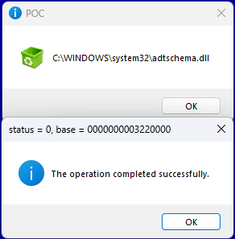
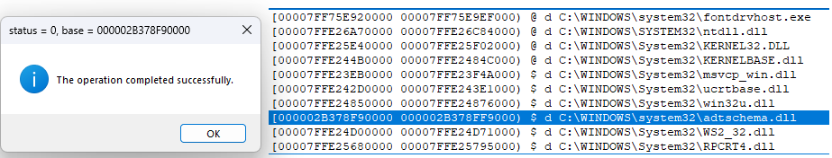

# ARL

injecting a DLL into a process directly from memory rather than from disk
for this shell code is used, which can load ANY dll from memory
this also show technique how write big and complex shell code on c++ (this will be too hard direct on asm)
code relative big, because it also support inject to processes with ProhibitDynamicCode mitigation (Arbitrary Code Guard (ACG))
if remove this case - code will became much smaller, also manual relocation need only in this case.
native loader fail here with STATUS_DYNAMIC_CODE_BLOCKED - because he will fail change memory protection for apply relocations ( in normal load case relocations will be applied in kernel)

-LDSC - shell code project - this is yet one demo how write shell code. also he is self convert own binary code to src asm file (used in EXE project)
-DLL - very simply DLL ( show message box and then unload itself) - used as demo for inject to explorer or cmd (in case wow64 process)
-EXE - injector. it first try inject embeded DLL to explorer, and then mswsock.dll (readed from disk to memory) for "fontdrvhost.exe" in 0 session (if this process exist). usually this process have ACG
dll loaded (if no error) until message box from EXE shown and then unloaded. in case wow64 process - we simply start new 32-bit cmd and inject to it after short delay

of couse code clean all resources/memory after self. dlls loaded and unloaded. shell code free own memory too (at the on of execution he do JMP to NtFreeVirtualMemory )
code implemented for x86/x64. of course use shell in x64 much more easy.

